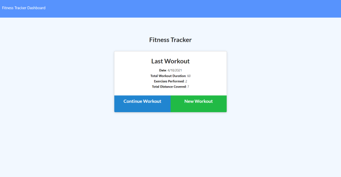
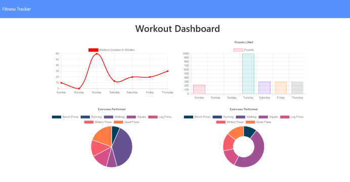

# WorkoutObligator

## Table of Contents
* [Description](#description)
* [Installation](#installation)
* [Usage](#usage)
* [License](#license)
* [Questions](#questions)

## Description
  This website allows the user to track recent workouts, facilitating better management of one's workout regiment. The workouts can be categorized as either resistance or cardio. The data entered can be stored locally or managed through heroku. 

## Installation
To install this application, add this repository to a folder on your device. Run npm install to acquire the necessary dependencies or simply use the link for the deployed application on heroku.

## Usage
To utlize this application, add one or more new exercises to be documented as the latest workout. The past 7 workouts will be displayed on the workout dashboard.

Deployed application: https://nameless-sands-74939.herokuapp.com/

## License
This project is licensed with Apache.

## Questions
Follow me on [Github](https://github.com/Kayvonk).

To contact me, send an email to kayvonk@gmail.com with your name and inquiry.

